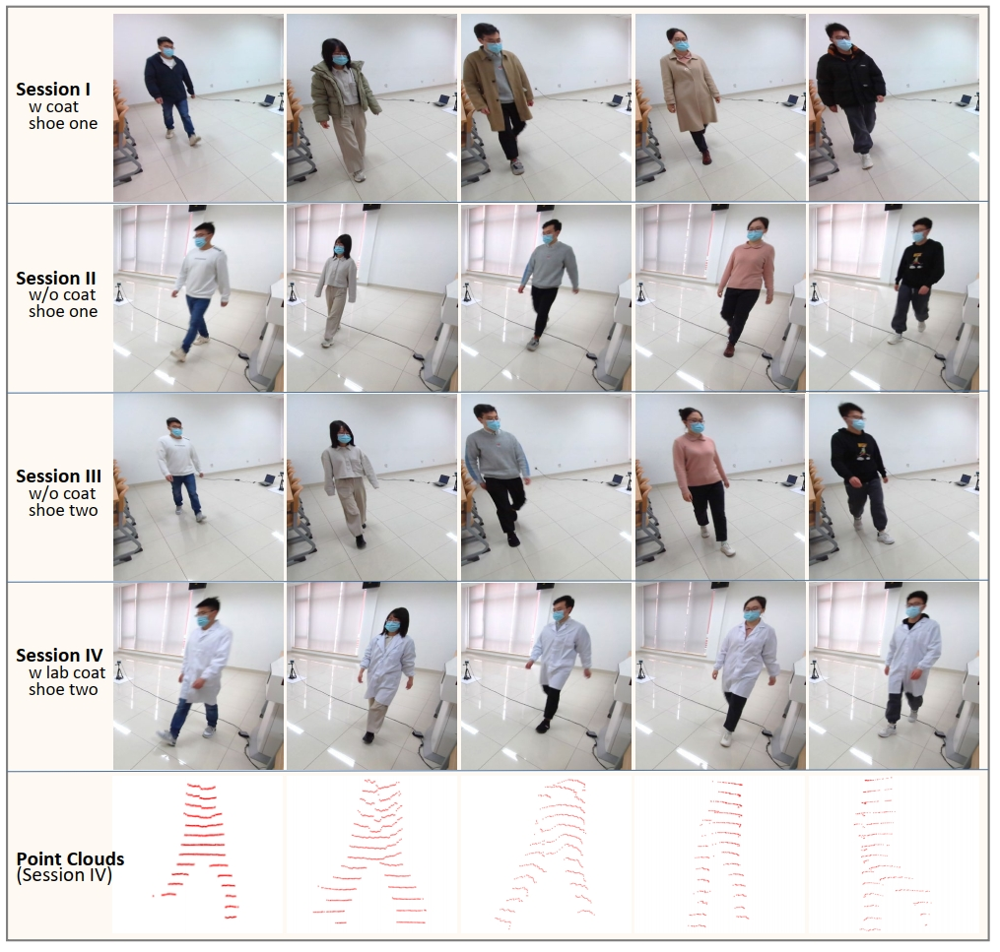
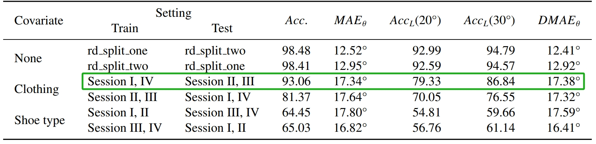

# AFPILD: Acoustic footstep dataset collected using one microphone array and LiDAR sensor for person identification and localization

This is a PyTorch implementation of our submitted [manuscript]().

**AFPILD:** Acoustic Footstep-based Person Identification and Localization Dataset.

**CRNN:** Convolutional Recurrent Neural Network.

**Abstract:** We build the acoustic footstep-based person identification and localization dataset (AFPILD) by unifying the identify and locate tasks for the first time, concerning the clothing and shoe type covariates. The AFPILD contains nearly 10 hours of footstep audios (around 62,174 footstep events). We also present the baseline works concerning the identification, localization, and synchronous identify-locate tasks, respectively, to compare various potential approaches on this dataset in the future.


## Acess to the AFPILD and this source code
**Note: The source code and the AFPILD are free for non-commercial research and education purposes.** Any commercial use should get formal permission first.
 
 The code and dataset are released under the [Creative Commons Attribution-NonCommercial-ShareAlike 4.0 International Public License](https://creativecommons.org/licenses/by-nc-sa/4.0/legalcode) for NonCommercial use only. 

 
The AFPILD could be downloaded from [Baidu pan](https://pan.baidu.com/s/15UqRVKgxlz_CywCp6xy6DA) fetch code: ytvf or [Google Drive](https://drive.google.com/file/d/1FQMWbG8oAoZKXfLYsNZ_W_yLj9cZOUGu/view?usp=share_link).

*Please cite our paper if you use any part of our source code or data in your research.*

## AFPILD Dataset description


#### Data recording procedure
To build such a new acoustic footstep dataset that involves the covariants of clothing, shoe type, and sound direction, each subject was instructed to perform four data collection sessions.
- At the start, the subjects were told to walk anticlockwise with their coat on. (**Session I**)
- Then, take off their coat and walk clockwise. (**Session II**)
- After that, change their shoes (nonuniform) and walk anticlockwise. (**Session III**)
- At last, put on the lab coat (uniform) and walk clockwise again. (**Session IV**)

For cross-modality data alignment, the subjects clapped their hands once loudly, at the beginning of each session, to generate a mark symbolic in audio and point clouds. 

They were told to walk as naturally as possible, we observed most of them swinging their hands naturally, and a few of them putting their hands into their pockets occasionally.

Each data recording session lasts around 220s, and 60s are put aside for a break between every two sessions. Subsequently, the AFPILD contains nearly 10 hours of acoustic footsteps from 40 subjects. 

Photo illustrations of the four data recording sessions are shown in Fig. 1.

<p align="center">
     <br/>
    <em> 
    Figure 1: Photo illustrations of our data recording sessions. The first row to the fourth row represents the data collection session I to IV, concerning the coat and shoe covariates. The last row shows the gait point clouds corresponding to the fourth session.
    </em>
</p>

#### Dataset structure
We released the first version of the AFPILD dataset (*AFPILD_v1*), which is formatted as following structures:
```
├─ /AFPILD_v1_root
|   README.md				this file, markdown-format
|   LICENSE                 the license file
│   ├── S01
│   |    ├── s01_1_footstep_annotation.csv
│   |    ├── s01_1_footstep_audio.wav
│   |    ├── ...
│   |    ├── s01_4_footstep_annotation.csv
│   |    ├── s01_4_footstep_audio.wav
│   | 
│   ├── S02
│   |    ├── ...
...

│   ├── S40
│   |    ├── s40_1_footstep_annotation.csv
│   |    ├── s40_1_footstep_audio.wav
│   |    ├── ...
│   |    ├── s40_4_footstep_annotation.csv
│   |    ├── s40_4_footstep_audio.wav
```
We released the raw four channels of acoustic footstep data and the corresponding metadata of desensitized labels (*S01, …, S40*), locations (azimuth angles), and footstep events segmentation vectors, for the community to try more effective audio feature extraction approaches and acoustic models. Therefore, each sub-folder contains four waveform files and their corresponding annotation metadata.

Each metadata file contains three columns, with *’sample_loc’* representing the sampling boundary of each footstep event, *‘loc_x’*, and *loc_y’* representing the annotated foot position in the cartesian coordinate.


## Requirements
- python>=3.9.13
- audioread>=3.0.0
- PyTorch>=1.12.1
- torchvision>=0.13.1
- pandas>=1.4.4
- librosa>=0.9.2 
- h5py>=3.7.0
- numpy>=1.21.5
- scikit-learn>=1.1.1
- scipy>=1.9.1
- matplotlib>=3.5.2


## Usage 

1. Download the [AFPILD](https://drive.google.com/file/d/1FQMWbG8oAoZKXfLYsNZ_W_yLj9cZOUGu/view?usp=share_link) and prepare the directory following the above dataset structure.


2. Generate various dataset variants, including audio feature extraction.
```
>> python scripts/spec_gcc_fea_ext_afpild.py 
```

3. Train the model with the *‘--task’* parameter chosen from *‘{ide/loc/ideloc/accil}\_{ori/ana}_{rd/cloth/shoe}’*. The *task* parameter specifies mono tasks of person identification (*ide*), localization (*loc*), multiple tasks of simultaneous identification and localization with two branches (*ideloc*), ACCDOA unified identification and localization (*accil*), the *primary* and *anastrophic* training settings, the covariates of *None*, *Cloth*, and *Shoe type*, respectively.
```
>> python train.py --task accil_ori_cloth
```

4. To evaluate the performance with the saved model stored in *'--resume'*.
```
>> python test_afpild.py  --task accil_ori_cloth --resume /saved/AFPILD-CRNN/your_model_path
```

## Results
We provide the pre-trained [model weights](https://drive.google.com/file/d/1bS0wQDThs8pWpNgVcFcqhCPnm7nU-Gpr/view?usp=sharing) for the *‘accil_ori_cloth’* task, that is the ACCDOA unified *ide&loc* task concerning the *cloth* covariate under the *primary* training setting.

If the code runs fine, it should print out similar scores as:
<p align="center">
     <br/>
    <em> 
    Figure 2: ACCDOA unified acoustic footstep-based person identification accuracies (%) and localization errors on AFPILD.
    </em>
</p>

## Code References
In this Codebase, we utilize code from the following source(s):

* [wave-spec-fusion](https://github.com/denfed/wave-spec-fusion) 

* [CRNN](https://github.com/sharathadavanne/seld-dcase2022) 

